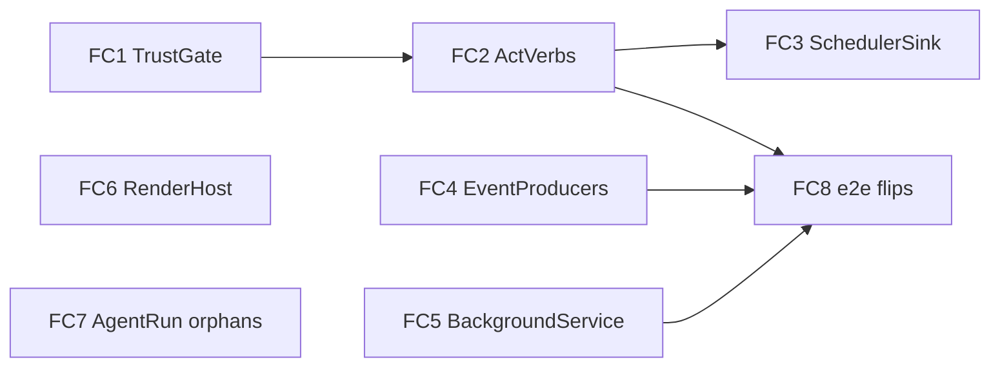

# Feature-Complete Workplan — pianola · plugins · agent-run

Status: WAVE COMPLETE (2026-07-01). Baseline: completeness audit of
`feat/autonomous-manager-agent` vs `origin/rc` (685f2462d), 2026-07-01.

## Where we stand (updated end of wave)

| Workstream                                                | State                                 | Commit(s)                       |
| --------------------------------------------------------- | ------------------------------------- | ------------------------------- |
| FC1 trusted-to-run + realm-escape + surfacing             | LANDED                                | 693e2d47f                       |
| FC2 act-verb spine (scopes/schemas/registry)              | LANDED                                | a95ea4157                       |
| FC2 consent UI (high-risk + unattended channels)          | LANDED                                | 47000cec3                       |
| FC2/FC3 final flip (dispatch/spawn/scheduler live)        | LANDED                                | 459f0ecee                       |
| FC4 event producers (history.entryAdded, agent.completed) | LANDED                                | feae6c0bf                       |
| FC5 background-service supervision + HOST_API 1.8.0       | LANDED                                | a95ea4157, 606dae5f6            |
| FC6 render host (per-plugin webview partition)            | LANDED                                | 4cc1f8e87                       |
| FC7 agent-run orphans (recovery + signals)                | LANDED                                | 01d8a468a, 90fb5e2b1, d3da2893c |
| FC8 harness/fixture groundwork                            | LANDED                                | 00ebea868                       |
| FC8 plugins.spec.ts rewrite (post-trust-gate world)       | LANDED — 13 passed, 1 documented skip | 57aee083f, aa9a1d68b            |
| Parked earlier agent-run wave (was uncommitted)           | LANDED                                | 8ca458d72, 859d3038e            |
| isPluginTrusted production wiring (found BY the e2e)      | LANDED                                | 93f1a3abf                       |

Note for reviewers: the FC1 trust gate means DEV-LOOP UNSIGNED PLUGINS NO
LONGER EXECUTE. Local plugin development now requires signing with a key listed
in the `pluginTrustedKeys` store setting (see the e2e harness for the pattern).

## Governing decision (recorded)

**Option B is the decided security model** (`Plans/plugin-platform-and-encore-uplift.md`
§"Security model (decided)", commit 2903e4e85): trusted-signed plugin + explicit
per-capability consent + Pianola risk gate is the boundary; the OS sandbox
(Option A) is future hardening. The `src/main/index.ts:1696` comment saying
act-verbs are "gated behind the Phase 3 sandbox decision" is **stale** — the
decision exists. What actually gates act-verbs is the **Option-B precondition
checklist** (`plugin-phase3-sandbox-decision.md` §Decision gate), and two items
are unmet in code today:

1. **No trusted-to-run gate**: `plugin-manager.ts:293-302` `isRunnable` accepts
   `signature.status !== 'invalid'` — unsigned/untrusted code may execute.
   Option B requires `=== 'trusted'` to RUN code (declarative contributions stay
   allowed for unsigned/untrusted).
2. **No realm-escape regression test**: only comments acknowledge escapability
   (`plugin-sandbox-entry.ts:17-20,247-251`). The canonical probe
   `(reachable).constructor.constructor('return process')()` must throw for
   every value reachable on the plugin global, enforced by a test.

## Workstreams

### FC1 — TrustGate (Option-B preconditions) — BLOCKS FC2 final wiring

- `isRunnable` requires `signature.status === 'trusted'` for code execution;
  unsigned/untrusted plugins remain installable/enableable for **declarative**
  contributions only (themes, prompts, UI slots). Loud status surfacing in
  Extensions details ("code disabled: untrusted").
- Realm-escape regression test: for every property on the sandbox global (SDK,
  module/exports, console, wrapped timers), the constructor-chain escape throws.
- Enable-a-code-plugin consent presents full-trust framing ("this plugin's code
  runs with your account's privileges"), not a capability list.
- E2E fixtures: harness signs the selftest plugin with a test-trusted key (the
  trust infrastructure already exists — `signing.ts`, `plugin-signature.ts`).
- _Acceptance:_ unit tests for the new gate + escape test green; existing plugin
  suites still green; e2e harness still green with trusted fixture.

### FC2 — Act-verbs (`agents:dispatch`, `process:spawn`) — after FC1 lands

Per `plugin-phase4-high-risk-verbs.md` (the spec, checklist §Wiring acceptance gate):

- Promote both caps from `scope:'none'` to `allowlist` scope (`permissions.ts:91,103`)
  with exhaustive set-membership matcher tests. Never wildcard.
- Separate, non-bundled consent stating arbitrary-code-execution blast radius,
  PLUS a distinct unattended/scheduler consent.
- Closed opts schemas at the broker boundary (dispatch: agentId+prompt only;
  spawn: host-owned binary allowlist — no shells/interpreters/paths, env from
  closed allowlist never `process.env`, no plugin cwd/flags, never `shell:true`).
- ActionGuard `DEFAULT_LIMITS.high` or tighter; audit written BEFORE effect.
- Wire `deps.dispatch` / `deps.spawn` in `src/main/index.ts` (~1696); replace the
  stale comment with a pointer to this plan + the phase-4 gate.
- _Acceptance:_ e2e matrix rows flip INERT→PASS for trusted+granted,
  DENY preserved for untrusted/ungranted (flips executed by FC8's e2e owner).

### FC3 — Scheduler dispatch sink — same owner as FC2, immediately after

- Inject the dispatch sink into `PluginSchedulerHost` (`index.ts:1875-1889`),
  with runtime-session addressing (resolve the cueTrigger's target agent/session
  at fire time). Preserve "skip loudly" when a target is gone.
- Unattended consent (from FC2) is REQUIRED for any auto-dispatch; notify-only
  remains the fallback for plugins without it.
- _Acceptance:_ an eligible cueTrigger auto-dispatches in test; without the
  unattended grant it notifies only.

### FC4 — Plugin-bus event producers

- `history.entryAdded`: emit on `pluginEventBus` at the history ingestion point
  (`ipc/handlers/history.ts:543` region currently renderer-only). Payload:
  ids/classification only per `events.ts:76-84`.
- `agent.completed`: emit rich payload (lineage, token totals, providerSessionId,
  queueDepth — `events.ts:86-112`) from the process exit path
  (`plugin-event-listener.ts` beside `agent.exited`). Metadata only, no output.
  Note: Cue's same-named `agent.completed` is a separate system — do not touch.
- Dispatch stays capability-gated (`history:read` / `agents:status` subscribers).
- _Acceptance:_ unit tests prove both topics fire with correct shape + gating.

### FC5 — background:service supervision

- Real supervised workers behind `deps.backgroundRegister` (currently in-memory
  Map, `plugin-host-handlers.ts:1040-1084`, dep never injected): registration
  spawns/tracks a supervised task with crash-restart (bounded backoff, mirror
  `pianola-supervisor.ts` discipline), health status, teardown on plugin
  disable/uninstall/reload.
- _Acceptance:_ tests — service survives a crash (restarts), stops on disable.

### FC6 — Render-host partition upgrade

- Replace/augment the srcdoc iframe (`PluginPanelFrame.tsx`) with the planned
  isolated surface: per-plugin session partition (`plugin:<id>`), no Node,
  contextIsolation, broker-only preload, navigation + egress lockdown
  (keep the `will-frame-navigate` backstop, `window-manager.ts:479`).
- Keep the existing postMessage bridge contract so plugin panels don't change.
- _Acceptance:_ trusted+granted panel renders; untrusted/ungranted denied;
  existing panel e2e stays green; nav/egress attempts blocked in test.

### FC7 — Agent-run orphans

- Wire `recoverNonTerminalRuns` (`recover-runs.ts`) at startup after store init,
  near `setupAgentRunCapture` (`main/index.ts:1948`) — crash recovery is a real
  gap. index.ts edit goes through the index.ts owner (see Ownership).
- `markNeedsReview`/`markFixing` (`signals.ts`): **DECIDED — wired, not deleted**
  (2026-07-01). The orchestrate path mirrored only running/completed/failed onto
  the run ledger; nothing wrote `fixing` at all, and `needs_review` only landed
  via desktop capture at process exit — never for the engine's mid-flight
  routing. Wiring the guarded producers closes both gaps without duplicating
  transition logic: `markNeedsReview` runs per-tick for engine-routed
  needs_review tasks (idempotent; ISC-5.8 guard keeps checks-only reviews off
  the run), `markFixing` fires inside `dispatchFix` only after a real
  `runDispatch` success (ISC-5.9). Startup recovery wired via
  `setup-recovery.ts` -> `setupAgentRunRecovery(processManager)` in index.ts
  (applied by the index.ts owner).
- _Acceptance:_ startup recovery covered by unit test; no uncalled exports left.

### FC8 — Test gaps (e2e owner)

- Grant-ledger relaunch e2e: grants survive app restart; revoke invalidates
  live; corrupt/missing keyring anchor forces re-consent (the plan's own
  "remaining acceptance", roadmap §WS-grant-ledger).
- Extend `PROBED_CAPS` (harness:25-42, currently 15 caps) with the 11 P3 caps —
  PASS/INERT/DENY rows each.
- Apply FC2's INERT→PASS matrix flips; add probes for FC4 events, FC5 service.
- _Acceptance:_ `bunx playwright test e2e/plugins.spec.ts` green.

## Ownership (collision control)

| Surface             | Single writer                                                                                 |
| ------------------- | --------------------------------------------------------------------------------------------- |
| `src/main/index.ts` | FC2/FC3 worker — ALL wiring edits route through it (FC4/FC5/FC7 DM their exact patch via irc) |
| `e2e/**`            | FC8 worker — FC2's matrix flips + fixture changes route through it                            |
| Everything else     | Owning workstream; irc broadcast before touching another stream's files                       |

## Sequencing

FC4, FC5, FC6, FC7 run parallel from the start; FC1 starts immediately; FC2/FC3
develop in parallel but final index.ts wiring waits for FC1; FC8 starts with the
grant-ledger e2e and lands matrix work as streams complete.

## Out of scope (follow-on, tracked, not this wave)

1. **Option A OS sandbox** (3-platform confinement) — future hardening per the
   recorded decision.
2. **`cue:emit` capability** — new spine surface, phase-4 doc §3; needs its own
   design pass after FC2.
3. **Encore lifts as plugins** (E-pianola, E-directorNotes, E-maestroCue,
   E-symphony, E-usageStats) — P4 of the roadmap; unblocked by FC2+FC5 landing.
4. **rc rebase/merge** — 68 commits behind; 27 collision files (EncoreTab
   refactor is the hot one). Do AFTER this wave lands, as its own task.
